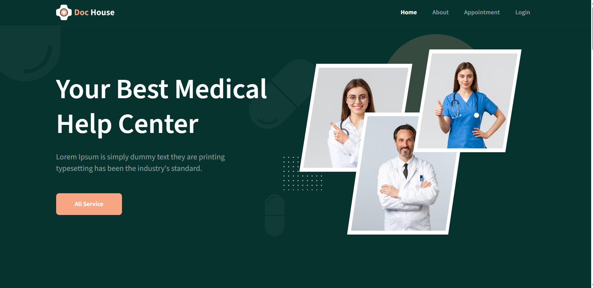
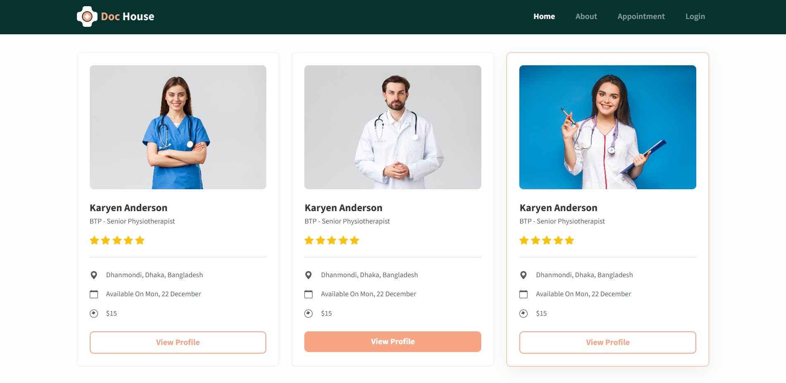
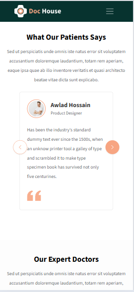
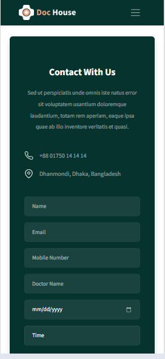

# 🏥 Doc House – Medical Help Center

**Doc House** is a professional, high-performance medical platform website. This project demonstrates advanced front-end development techniques, including complex Bootstrap 5 grid layouts, custom CSS animations, and a fully responsive mobile-first architecture.

---

## 🔗 Project Links

* **Live Demo:** [View Hosted Project](https://doc-house-j03p4ydra-rakibul-efty20s-projects.vercel.app/)
* **Source Code:** [GitHub Repository](https://github.com/rakibul-efty20/DOC_HOUSE_Bootstarp_BSS)

---

## ✨ Key Features

### 💻 Modern Landing Page
- **Custom Hero Section:** Featuring a floating multi-image doctor gallery and unique brand-consistent vector backgrounds.
- **Interactive Service Tabs:** A seamless interface for patients to browse specialized treatments (Cavity Protection, Cosmetic Dentistry, etc.).
- **Patient Testimonials:** A stylized feedback section with custom card designs and SVG quote integrations.

### 👩‍⚕️ Advanced Doctor Profile System
- **Dynamic Profile Cards:** Detailed view featuring custom rating stars, location tracking with SVG icons, and a responsive image gallery.
- **Multi-Tab Information:** Cleanly organized data using Bootstrap Nav-Tabs to toggle between Overview, Locations, Reviews, and Business Hours.

### 📱 Responsive Excellence
- **Precision Footer:** A 4-column optimized footer using Bootstrap offsets and flexbox to achieve perfect spacing on PC while centering all content on mobile.
- **Mobile-First Design:** Custom media queries ensure a seamless experience across all device sizes.

---

## 📸 Screenshots

### Desktop View
| Home Page | Doctor Profile |
| :---: | :---: |
|  |  |

### Mobile View
| Mobile Home | Mobile Profile |
| :---: | :---: |
|  |  |

---

## 🛠️ Tech Stack

- **HTML5:** Semantic structure for better SEO and accessibility.
- **CSS3:** Custom BEM (Block Element Modifier) methodology, advanced transforms, and responsive design.
- **Bootstrap 5.3:** Utilized for the grid system, utility classes, and interactive components.
- **SVG Graphics:** High-resolution, lightweight vector icons used for UI elements and ratings.
- **JavaScript (ES6+):** Interactive tab switching and UI logic.

---

## 📂 Project Structure

```text
├── img/                # Optimized image assets and screenshots
├── index.html          # Main Landing Page
├── doctor-profile.html # Detailed Doctor Profile Page
├── style.css           # Custom stylesheets and responsive media queries
└── README.md           # Project documentation